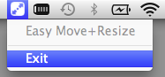

> Forked to change modifier to simply `Cmd` (and eventually, to make all resizing happen in the bottom right corner like DWM.

#  Easy Move+Resize

Adds easy `modifier key + mouse drag` move and resize to OSX

## Usage
**Easy Move+Resize** is based on behavior found in many X11/Linux window managers
* `Cmd + Ctrl + Left Mouse` anywhere inside a window, then drag to move
* `Cmd + Ctrl + Right Mouse` anywhere inside a window, then drag to resize
    * the resize direction is determined by which region of the window is clicked.  *i.e.* a right-click in roughly the top-left corner of a window will act as if you grabbed the top left corner, whereas a right-click in roughly the top-center of a window will act as if you grabbed the top of the window

## Installation
* Grab the latest version from the [Releases page](https://github.com/dmarcotte/easy-move-resize/releases)
* Unzip and run!
* Select **Exit** from the application icon to quit

    

    

## Contributing

[Contributions](contributing.md) welcome!