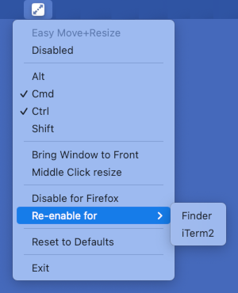

#  Easy Move+Resize

Adds easy `modifier key + mouse drag` move and resize to OSX

## Usage

**Easy Move+Resize** is based on behavior found in many X11/Linux window managers



- `Cmd + Ctrl + Left Mouse` anywhere inside a window, then drag to ***move***.
- `Cmd + Ctrl + Right Mouse` anywhere inside a window, then drag to ***resize***,
    - The resize direction is determined by which region of the window is clicked. *i.e.* a right-click in roughly the top-left corner of a window will act as if you grabbed the top left corner, whereas a right-click in roughly the top-center of a window will act as if you grabbed the top of the window.
    - To use the middle mouse button as the resize modifier, select the `Middle Click resize` menu item.
- The choice of modifier keys to hold down to activate dragging or resizing can be customized by toggling the appropriate modifier key name in the application icon menu.
    - Click the menu item to toggle it.
    - All keys toggled to selected must be held down for activation.
- Behavior can be disabled by toggling the `Disabled` item in the application icon menu.
- If you are dragging or resizing a window in the background and want it to rise to the top, select the `Bring Window to Front` menu item.
- To restore application settings, select the `Reset to Defaults` menu item.
- To disable for a particular app, select `Disable for ...` from the menu after using **Easy Move+Resize** on that app.

## Installation

### brew

```sh
brew install --cask easy-move-plus-resize
```

### manually

* Grab the latest version from the [Releases page](https://github.com/dmarcotte/easy-move-resize/releases)
* Unzip and run!

### troubleshooting

- If MacOS refuses to launch **Easy Move+Resize** because it "cannot check it for malicious software": [see here](https://github.com/dmarcotte/easy-move-resize/issues/84#issuecomment-1184946746)
- If Accessibility permission for **Easy Move+Resize** is not working: [see here](https://github.com/dmarcotte/easy-move-resize/issues/79#issuecomment-1109070242) 

## Contributing

[Contributions](contributing.md) welcome!

## Release process

- Choose a new version number following [semantic versioning guidelines](https://semver.org)
- Update the version number in [`easy-move-resize/easy-move-resize-Info.plist`](easy-move-resize/easy-move-resize-Info.plist), ([example](https://github.com/dmarcotte/easy-move-resize/commit/18d759dec2caf7a33b0625c17c181a195191bc92)) 
- `git tag <chosen version number>`
- `git push origin --tags`
- In XCode, choose `Product->Archive`
- Click "Distribute App", select "Copy App", "Next", then "Export"
- In a shell, navigate to the directory created, then:
- `zip -r Easy.Move+Resize.app.zip Easy\ Move+Resize.app`
- Upload the resulting zip file to the appropriate tag on the [Releases](https://github.com/dmarcotte/easy-move-resize/releases) page
